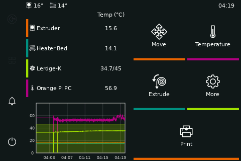
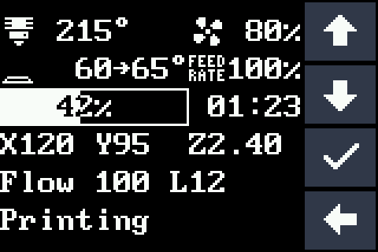
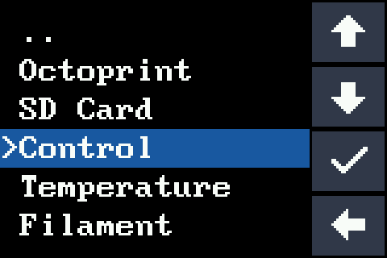

# Klipper на платах Lerdge – со штатным экраном Lerdge

[English](README.md) | **Русский**

Штатный экран Lerdge – цветной 3,5" сенсорный экран, с модулем-крутилкой
Lerdge или без него – работает с [Klipper](https://www.klipper3d.org/): на нём
можно запустить полноценный
[KlipperScreen](https://github.com/KlipperScreen/KlipperScreen) или встроенное
меню Klipper. Всё ставится одним скриптом.

<p align="center">
  <br>
  <em>KlipperScreen на экране Lerdge 480×320</em>
</p>

<p align="center">
  
  <br>
  <em>Режим встроенного меню Klipper с сенсорными кнопками</em>
</p>

## Содержание

- [Возможности](#возможности)
- [Поддерживаемое оборудование](#поддерживаемое-оборудование)
- [Как это работает](#как-это-работает)
- [Что нужно](#что-нужно)
- [Установка](#установка)
- [Пользование экраном](#пользование-экраном)
- [Настройка](#настройка)
- [Обновление](#обновление)
- [Скорость связи с платой](#скорость-связи-с-платой)
- [Удаление](#удаление)
- [Решение проблем](#решение-проблем)
- [Технические подробности](#технические-подробности)
- [Разработка](#разработка)
- [Благодарности и лицензия](#благодарности-и-лицензия)

## Возможности

- **KlipperScreen на экране Lerdge.** Второй экземпляр KlipperScreen
  работает на хосте на виртуальном экране 480×320, и его изображение
  передаётся на экран принтера. Работает всё: печать файлов, температуры,
  перемещение, экструзия, макросы, настройки, темы.
- **Или встроенное меню Klipper.** Стандартный экран статуса и меню Klipper
  крупным шрифтом (16×6 символов) с сенсорными кнопками; строки меню можно
  нажимать пальцем. На хосте ничего дополнительно не запускается.
- **Жесты.** Касание – нажатие, свайп – прокрутка списков, удержание –
  долгое нажатие. Калибровка тача по пяти точкам.
- **Модуль-крутилка.** Дополнительный энкодер Lerdge с кнопкой работает в
  обоих режимах: вращение перемещает по меню (или по кнопкам
  KlipperScreen), нажатие выбирает, долгое нажатие – назад.
- **Работает и после ошибок.** Тач опрашивает сама плата, поэтому после
  аварийной остановки Klipper на экране можно нажать *Firmware Restart*.
- **Обновление прошивки с хоста.** Установщик записывает прошивку на
  TF-карту в плате, штатный загрузчик Lerdge ставит её при включении
  принтера, а файл удаляется автоматически. После первой установки карту
  доставать больше не нужно.
- **Быстрая и надёжная связь.** До 1,5 Мбод между хостом и платой с
  автоматическим возвратом на 250000, если провода не тянут высокую
  скорость.
- **Один установщик.** Накладывает патчи на ваш Klipper, собирает и
  устанавливает прошивку, прописывает конфигурацию и службы.
- Не мешает KlipperScreen на HDMI-экране – они работают одновременно.

## Поддерживаемое оборудование

| Плата | Статус | Примечания |
| --- | --- | --- |
| **Lerdge-K** | ✅ Проверено (Anycubic Predator, хост Orange Pi PC) | Прерывание тача на PG12 |
| **Lerdge-X** | ⚠️ Должно работать, не проверено | Тот же экран и загрузчик; CS тача на PB6, без пина прерывания (распиновка из Marlin) |
| Lerdge-S | ❌ Установщик не поддерживает | Тот же экран; имя файла для загрузчика неизвестно – см. [docs/hardware.md](docs/hardware.md) |

У плат Lerdge один тип экрана: цветной сенсорный Lerdge 3,5" 480×320
(контроллер ST7796S, резистивный тач XPT2046). Отдельно Lerdge продаёт
**модуль-крутилку** – энкодер с кнопкой, который ставится на этот же
сенсорный экран (комплект «экран + knob»); он тоже поддерживается.
Отдельного экрана только с крутилкой нет. Драйвер поддерживает и экраны на
ILI9488 / ILI9341 (определяются автоматически).

**Хост** – любой Linux-компьютер, на котором уже работают Klipper и
Moonraker (Raspberry Pi, Orange Pi, другие одноплатники или ПК), с ОС на
базе Debian (Raspberry Pi OS, Armbian, MainsailOS, FluiddPI, Debian,
Ubuntu). Плата подключается через свой USB-порт или напрямую к UART
(USART1, PA9/PA10).

## Как это работает

Klipper «из коробки» поддерживает только маленькие символьные и
монохромные дисплеи. Экран Lerdge – это «голая» TFT-матрица на
параллельной шине памяти (FSMC) микроконтроллера STM32F407 платы,
поэтому проект добавляет:

- **код в прошивку платы** (`src/stm32/tft_fsmc.c`) – примитивы рисования
  (заливки, масштабированные битмапы, сжатый RLE-поток пикселей) и чтение
  тача;
- **модуль дисплея Klipper** (`lerdge_tft`) – инициализация экрана, меню
  Klipper, тач и калибровка, API для внешних программ;
- **службу зеркала** (`lerdge_mirror.py`) – берёт картинку KlipperScreen с
  виртуального X-дисплея (Xvfb), отправляет на плату только изменившиеся
  области в сжатом виде и превращает касания в клики и прокрутку;
- **поддержку загрузчика Lerdge** – шифрование прошивки, цели
  `lerdge-k`/`lerdge-x` для `flash-sdcard.sh` из Klipper и правильную
  раскладку памяти, которую требует загрузчик.

Изменения хранятся в виде серии патчей (`patches/`) поверх официального
Klipper. Установщик накладывает их на ваш Klipper в локальной ветке
`lerdge`.

## Что нужно

- Klipper и Moonraker, установленные обычным способом (например,
  через [KIAUH](https://github.com/dw-0/kiauh)) в `~/klipper` и
  `~/printer_data` (другие пути можно указать установщику).
- Рабочий `printer.cfg` для вашего принтера.
- **TF-карта (microSD), отформатированная в FAT32**, любого объёма, которая
  остаётся в TF-слоте платы. С неё загрузчик Lerdge ставит прошивку.
- Около 300 МБ свободного места на хосте (компилятор ARM), а для режима
  KlipperScreen – около 150 МБ оперативной памяти.

## Установка

### 1. Скачать

Зайдите на хост по SSH под пользователем, от которого работает Klipper:

```bash
cd ~
git clone https://github.com/ArtemFesunenko/klipper-lerdge-tft.git
cd klipper-lerdge-tft
```

### 2. Запустить установщик

```bash
./install.sh
```

Установщик задаст несколько вопросов (у всех есть разумные значения по
умолчанию):

| Вопрос | Ответ |
| --- | --- |
| Тип платы | `k` – Lerdge-K, `x` – Lerdge-X |
| Показывать KlipperScreen на экране Lerdge | `y` – KlipperScreen, `n` – встроенное меню |
| Установлен ли модуль-крутилка | `y`, если на экране стоит энкодер Lerdge |
| Скорость связи с платой | `1500000` (рекомендуется для KlipperScreen) или `250000` |
| Способ установки прошивки | `file` – первая установка, `sd` – если на плате уже Klipper (и есть TF-карта) |

Затем он наложит патчи на Klipper, поставит нужные пакеты (компилятор ARM,
а для KlipperScreen – Xvfb, numpy, python-xlib) и соберёт прошивку.

На все вопросы можно ответить параметрами, например:

```bash
./install.sh --board k --mirror --baud 1500000 --flash file
```

Все параметры: `./install.sh --help`.

### 3а. Первая установка (на плате штатная прошивка Lerdge)

Выберите `file`. Установщик создаст файл
`~/lerdge_firmware/Lerdge_K_system/Firmware/Lerdge_K_firmware_force.bin`
(`Lerdge_X_...` для Lerdge-X), настроит Klipper и подскажет, что делать:

1. Скопируйте всю папку `Lerdge_K_system` в **корень** TF-карты FAT32
   (установщик покажет готовую команду `scp`) и вставьте карту в TF-слот
   платы Lerdge. **Оставьте её там** – она нужна и для следующих
   обновлений.
2. Если секция `[mcu]` в `printer.cfg` была написана под штатную прошивку,
   укажите в `serial:` порт платы (например, `/dev/ttyUSB0`,
   `/dev/serial/by-id/...` или UART хоста, как `/dev/ttyS3`).
3. Выключите и включите принтер (см. [3в](#3в-выключение-и-включение-принтера)).

### 3б. На плате уже работает Klipper

Если на плате уже стоит Klipper, собранный под загрузчик Lerdge (смещение
64KiB), и в TF-слоте есть карта FAT32 – выберите `sd`. Установщик
запишет новую прошивку на карту через работающую прошивку и настроит
Klipper. Затем выключите и включите принтер (см.
[3в](#3в-выключение-и-включение-принтера)).

### 3в. Выключение и включение принтера

Загрузчик Lerdge читает карту только после снятия питания (карта должна
выйти из режима, в котором её записывал установщик), поэтому после каждой
установки прошивки принтер нужно один раз выключить и включить:

- **Хост питается от принтера:** сначала выключите хост
  (`sudo poweroff`), дождитесь выключения, выключите принтер, подождите 10
  секунд и включите. При старте хоста одноразовая служба проверит новую
  прошивку и удалит файл с карты ещё до запуска Klipper – больше ничего
  делать не нужно. Результат пишется в
  `~/printer_data/logs/lerdge-firmware.log`.
- **У хоста отдельное питание:** выключите и включите принтер, затем
  выполните `~/klipper-lerdge-tft/install.sh --finish`.

Загрузчик ставит прошивку за несколько секунд (сообщения об обновлении
логотипа/интерфейса/шрифтов – нормально).

### 4. Калибровка тача

При первом запуске на экране Lerdge появятся пять крестиков: коснитесь
центра каждого (задержите палец на мгновение). Затем сохраните результат:

```
SAVE_CONFIG
```

Перекалибровать можно в любой момент командой `TOUCH_CALIBRATE`.

## Пользование экраном

**Режим KlipperScreen**

- касание – нажатие кнопки;
- свайп вверх/вниз – прокрутка списков (файлы, макросы, настройки);
- удержание пальца на месте 0,6 с – долгое нажатие.

Если служба зеркала остановится, через 20 секунд экран переключится на
встроенное меню и сам вернётся к KlipperScreen, когда служба снова
заработает.

**Режим встроенного меню**

- касание экрана статуса – открыть меню;
- ▲ / ▼ – перемещение по меню или изменение значения при редактировании
  (удержание – автоповтор);
- ✓ – выбрать (удержание – долгое нажатие), ◄ – назад;
- касание строки меню выделяет её, повторное касание – выбирает.

**Модуль-крутилка**

| Действие | Режим KlipperScreen | Режим встроенного меню |
| --- | --- | --- |
| Вращение | Перемещение подсветки между кнопками | Перемещение по меню / изменение значения |
| Нажатие | Нажать подсвеченную кнопку | Выбрать |
| Долгое нажатие (0,8 с) | Вернуться на главный экран | Долгое нажатие (действие меню) |

Если подсветка погашена (`backlight_timeout`), первое касание или поворот
крутилки только включает её.

**Команды G-code**

| Команда | Описание |
| --- | --- |
| `TOUCH_CALIBRATE` | Калибровка тача (потом `SAVE_CONFIG`) |
| `TFT_REDRAW` | Перерисовать экран |
| `TFT_REDRAW INIT=1` | Заново инициализировать контроллер экрана |

## Настройка

Экран настраивается в файле `~/printer_data/config/lerdge_tft.cfg`,
который подключается из `printer.cfg`. Полезные параметры:

| Параметр | По умолчанию | Описание |
| --- | --- | --- |
| `rotate_180` | `False` | Повернуть изображение (калибровка тача сохраняется) |
| `touch_tap_activates` | `False` | Встроенное меню: выбор строки с первого касания |
| `backlight_timeout` | `0` | Гасить подсветку через столько секунд без касаний (0 – никогда) |
| `beeper_pin` | – | Щелчок при каждом касании (Lerdge-K: `PC7`, Lerdge-X: `PD12`) |
| `touch_pressure_threshold` | `300` | Уменьшите, если лёгкие касания не срабатывают |
| `encoder_pins`, `click_pin` | закомментированы | Модуль-крутилка (Lerdge-K: `^PG11, ^PG10` и `^!PG9`; Lerdge-X: `^PE4, ^PE3` и `^!PE2`) – установщик включает их, если ответить, что крутилка стоит |
| `encoder_steps_per_detent` | `4` | Поставьте `2`, если один щелчок крутилки сдвигает на два шага |
| `controller` | `auto` | `st7796`, `ili9488` или `ili9341`, если автоопределение не сработало |
| `invert_colors` | как у контроллера | Исправить «негатив» |
| `background_color`, `text_color`, `button_color`, … | | Цвета встроенного меню (`RRGGBB`) |
| `fsmc_write_addset`, `fsmc_write_datast` | `4`, `10` | Медленнее шина, если на изображении артефакты |

У KlipperScreen на экране Lerdge свой файл настроек –
`~/printer_data/config/KlipperScreen-lerdge.conf` (тема, размер шрифта и
т. д., см. [документацию KlipperScreen](https://klipperscreen.readthedocs.io/en/latest/Configuration/)).

`lerdge_tft.cfg` и `KlipperScreen-lerdge.conf` установщик создаёт только
если их ещё нет, поэтому ваши правки сохраняются при повторном запуске.

## Обновление

Klipper работает в локальной ветке `lerdge`, поэтому **не обновляйте
Klipper из Mainsail/Fluidd** (Moonraker показывает репозиторий Klipper как
«invalid»/«diverged» – это ожидаемо). Чтобы обновить Klipper и этот проект:

```bash
cd ~/klipper-lerdge-tft
git pull
./install.sh --update
```

Скрипт скачает свежий Klipper, заново наложит патчи, обновит Python-пакеты
Klipper, пересоберёт прошивку и запишет её на TF-карту – после этого
выключите и включите принтер, как в [3в](#3в-выключение-и-включение-принтера).
Остальное
(Moonraker, Mainsail/Fluidd, KlipperScreen) обновляется из веб-интерфейса
как обычно.

## Скорость связи с платой

Полный кадр KlipperScreen после сжатия – около 30 КБ: ~0,2 с на 1500000
бод и ~1,4 с на 250000. Скорость 1500000 без погрешности получается и на
STM32F407 (84 МГц / 1,5 МГц = 56), и на большинстве UART хостов (например,
24 МГц на процессорах Allwinner) и USB-UART микросхемах.

В прошивке есть страховка: пока не придёт первая корректная посылка, плата
каждые 20 секунд переключается между 1500000 и 250000 бод. Если хост не
может подключиться на 1500000 (длинные или плохие провода), укажите
`baud: 250000` в секции `[mcu]` файла `printer.cfg` и перезапустите
Klipper – плата подключится на 250000. Чтобы перейти на 250000 насовсем,
выполните `./install.sh --update --baud 250000`.

## Удаление

```bash
~/klipper-lerdge-tft/uninstall.sh
```

Скрипт удалит службы зеркала KlipperScreen, уберёт экран из `printer.cfg`
(резервные копии сохраняются) и вернёт Klipper на официальную ветку. На
плате останется прошивка с поддержкой Lerdge, пока вы не прошьёте другую
(соберите её через `make menuconfig`: STM32F407, 64KiB bootloader, кварц
25 МГц, USART1 – и установите через TF-карту).

## Решение проблем

**Экран белый или чёрный.**
Найдите в `~/printer_data/logs/klippy.log` строку `lerdge_tft: display id ...`.
Если id равен `0000` или `ffff`, укажите в `lerdge_tft.cfg`
`controller: st7796`. Убедитесь, что на плате пропатченная прошивка
(установщик выводит её версию).

**Klipper не подключается к плате.**
Если выбрана скорость 1500000, провода могут её не тянуть: укажите
`baud: 250000` в `[mcu]` (см. [Скорость связи с платой](#скорость-связи-с-платой)).
Если прошивка совсем не запускается, установите файл прошивки заново через
TF-карту (`./install.sh --flash file`).

**Касания не срабатывают или промахиваются.**
Выполните `TOUCH_CALIBRATE` и `SAVE_CONFIG`. Если не срабатывают лёгкие
касания, уменьшите `touch_pressure_threshold`. На Lerdge-X проверьте
`touch_cs_pin: PB6`.

**KlipperScreen не появляется на экране Lerdge.**
Проверьте службы и их журналы:

```bash
systemctl status lerdge-xvfb KlipperScreen-lerdge lerdge-mirror
journalctl -u lerdge-mirror -n 50
tail -50 ~/printer_data/logs/KlipperScreen-lerdge.log
```

**Обновление прошивки не проходит.**
«No usable TF card» – вставьте в TF-слот платы карту FAT32. «Could not
connect to the board» – на плате не Klipper (используйте `--flash file`)
или неверная скорость в `[mcu]`. Если после выключения и включения на
плате осталась старая прошивка, посмотрите
`~/printer_data/logs/lerdge-firmware.log` и проверьте, что папка
`Lerdge_K_system` лежит в корне карты.

**Крутилка вращается не в ту сторону.**
Поменяйте местами два пина в `encoder_pins` в `lerdge_tft.cfg`. Чтобы
добавить крутилку позже, запустите установщик ещё раз и ответьте `y` на
вопрос про неё (или раскомментируйте `encoder_pins`/`click_pin` и добавьте
`keyboard_navigation: True` в секцию `[main]` файла
`KlipperScreen-lerdge.conf`).

**Изображение перевёрнуто.**
Укажите `rotate_180: True` в `lerdge_tft.cfg`.

**Общий совет:** всегда выключайте хост (`sudo poweroff` или из
Mainsail/Fluidd) перед выключением принтера. Если обесточить работающий
Linux-хост, его SD-карта может повредиться.

## Технические подробности

В [docs/hardware.md](docs/hardware.md) – распиновка, подробности об экране и
таче, поведение загрузчика Lerdge и то, как всё это было найдено (разбор
штатной прошивки Lerdge-K V4.3.3 и загрузчика V1.0.4).

## Разработка

Изменения Klipper хранятся в `patches/` как серия `git format-patch`.
Чтобы их править, наложите патчи (`./install.sh --build-only`), внесите и
закоммитьте изменения в ветке `lerdge` вашего Klipper, затем снова
выгрузите серию:

```bash
tools/export-patches.sh ~/klipper <базовый коммит upstream> lerdge
```

## Благодарности и лицензия

- [Klipper](https://github.com/Klipper3d/klipper) (Kevin O'Connor и
  участники) – проект является набором патчей к нему.
- [KlipperScreen](https://github.com/KlipperScreen/KlipperScreen).
- Распиновка Lerdge-X и Lerdge-S взята из
  [Marlin](https://github.com/MarlinFirmware/Marlin); алгоритм шифрования
  прошивки – тот же, что в скриптах сборки Marlin для Lerdge.

Лицензия GNU GPL v3.0, как у Klipper – см. [LICENSE](LICENSE).
